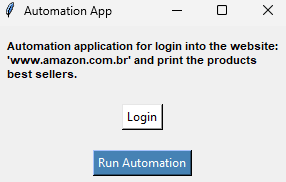
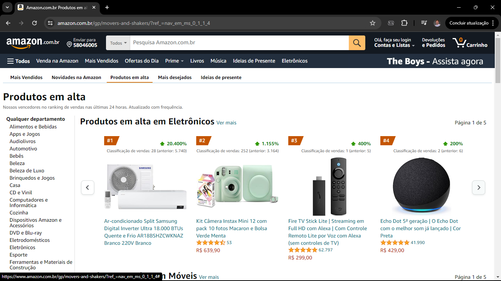

# Desktop Application Project for Automation

## Index
- [Description](#Description)
- [Resources](#Resources)
- [Installation](#Installation)
- [Execution](#Execution)
- [Author](#Author)
- [References](#References)
- [License](#License)

## Description
Desktop Application Project + RPA (Robotic Process Automation) to automate login to the Amazon website and print the best-selling products using Python + pyautogui + tkinter.



The project consists of automating the following process:
```
01. Press the Windows key;
02. Write chrome;
03. Press enter;
04. Press win + up to maximize the screen;
05. Write the website URL;
06. Press enter;
07. Click the mouse pointer on button 3 for login;
08. Write e-mail;
09. Press enter;
10. Write password;
11. Press enter;
12. Click on the position of image_0.png;
13. Click on the position of image_1.png;
14. Identify the position of image_2.png and start a 6x Loop to obtain a print of each session;
    11.1. Screenshot;
    11.2. Click button.
15. Return to top of page;
16. Position the mouse over the login area;
17. Logout on website;
18. Open screenshots.
```

OBS: The desired coordinates can be obtained by click on the coordinates buttons.

OBS: The generated prints will be stored in the "prints" folder.



## Resources
```
Python 3.12.4

Python libraries: 
  - pyautogui
  - tkinter
  - time
  - threading
  - os
  - subprocess

Browser: Chrome
```

## Installation

to install Python 3.12.4 access: 
```
python.org
```

to install pyautogui run: 
```
python3 -m pip install pyautogui
```

To install others libraries run: 
```
python3 pip install tkinter, time, threading, os, subprocess
```

## Execution

1. Run the "interface.py" file:
```
python3 interface.py
```
Optional: Enter a valid account to log in Amazon website;

2. Click on the run button and wait for the automation.

## Author

[André Medeiros](https://github.com/andreemedeiros)

Contribution to the project [Print Automation](https://github.com/andreemedeiros/Print-Automation/graphs/contributors)

## References

[Official pyautogui documentation](https://pyautogui.readthedocs.io/en/latest/#)


## License
This project is licensed under the MIT License - see [LICENSE.md](LICENSE.md) for more details.
