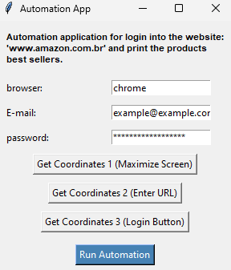

# Project RPA (Robotic Process Automation) for Automation Search item in Amazon Marketplace (python + pyautogui + tkinter)

## Index
- [Description](#Description)
- [Resources](#Resources)
- [Installation](#Installation)
- [Execution](#Execution)
- [Author](#Author)
- [References](#References)
- [License](#License)

## Description
GUI (Graphical User Interface) automation project for search item on Amazon Marketplace using Python + pyautogui + tkinter.

projeto rpa de automação para automatizar login no site da amazon e printar os produtos mais vendidos.

data: 15/06/2024



The project consists of automating the following process:
```
01. Aperta a tecla windows;
02. Escreve chrome;
03. Aperta enter;
04. Click the mouse pointer on button 1 for maximize a tela;
05. Click the mouse pointer on button 2 for link website;
06. Escreve o o url do site;
07. Aperta enter;
08. Click the mouse pointer on button 3 for login;
09. Write e-mail;
10. Aperta enter;
11. Write password;
12. Aperta enter;
13. Clica na posição da image_0.png;
14. Clica na posição da image_1.png;
15. Identificar a posicao da image_2.png e inicia um Loop de 6x para obter print de cada sessão;
    11.1. Tirar print;
    11.2. clicar.
16. Volta para o início da página;
17. Posiciona o mouse sobre a área de login;
18. Faz logout no site.
19. Abrir prints
```

OBS: The generated prints will be stored in the "prints" folder.

OBS: The desired coordinates can be obtained by click on the coordinates buttons.

## Resources
```
Python 3.12.4

Python libraries: 
  - pyautogui
  - tkinter
  - time
  - threading
  - os
  - subprocess
```

## Installation

to install Python 3.12.4 access: 
```
python.org
```

to install pyautogui run: 
```
python3 -m pip install pyautogui
```

optional: to install tkinter run: 
```
python3 pip install tkinter
```

## Execution

Run the "interface.py" file.
```
python3 script.py
```

## Author

[André Medeiros](https://github.com/andreemedeiros)

Contribution to the project [Print Automation](https://github.com/andreemedeiros/Print-Automation/graphs/contributors)

## References

[Official pyautogui documentation](https://pyautogui.readthedocs.io/en/latest/#)


## License
This project is licensed under the MIT License - see [LICENSE.md](LICENSE.md) for more details.
